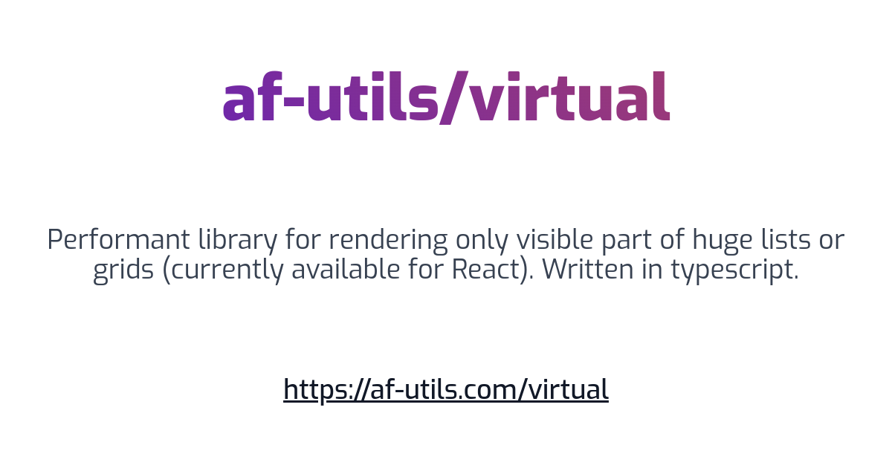
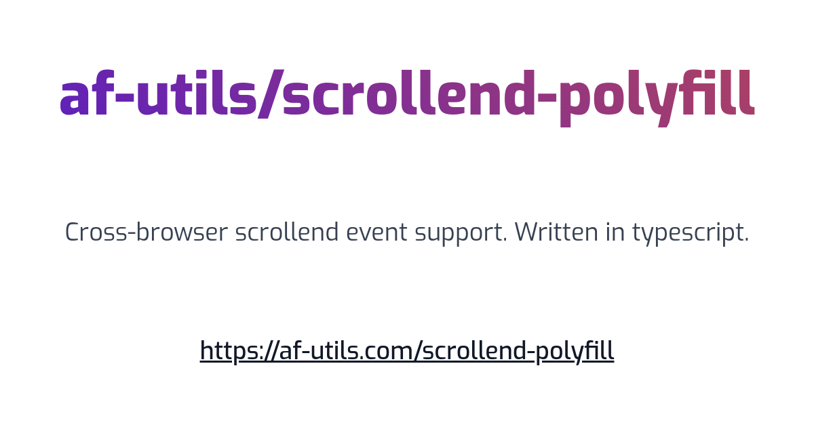

# af-utils/\*

Simple open-source tools that just work _(usually fast)_

## [Virtual scroll](https://af-utils.com/virtual)

### Features

-   [vertical](https://af-utils.com/virtual/examples/react/list/simple) / [horizontal](https://af-utils.com/virtual/examples/react/list/horizontal) / [grid](https://af-utils.com/virtual/examples/react/hook/grid) / [custom](https://af-utils.com/virtual/examples/react/hook/custom-render) modes
-   [dynamic item sizes](https://af-utils.com/virtual/examples/react/list/variable-size-list)
-   [sticky header and footer](https://af-utils.com/virtual/examples/react/list/sticky-header-and-footer)
-   [scrollToIndex method](https://af-utils.com/virtual/examples/react/list/scroll-to-item)
-   [load on demand](https://af-utils.com/virtual/examples/react/list/load-on-demand)
-   [window scroll](https://af-utils.com/virtual/examples/react/hook/window-scroll)
-   [material-ui](https://af-utils.com/virtual/examples/react/list/material-ui) / [bootstrap](https://af-utils.com/virtual/examples/react/list/bootstrap) integration

## [Scrollend polyfill](https://af-utils.com/scrollend-polyfill)

