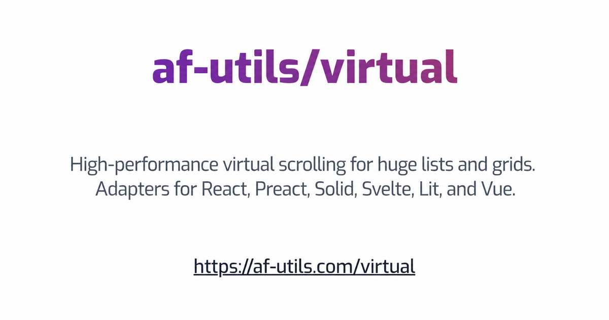
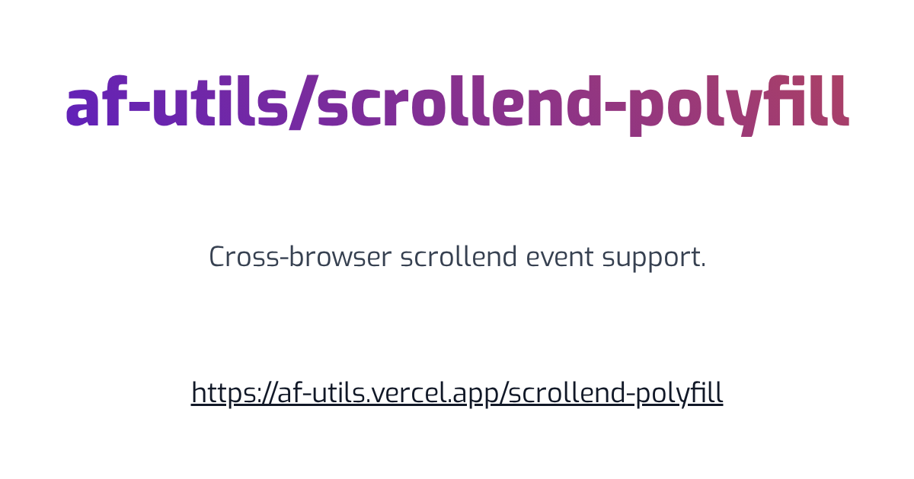

# af-utils/\*

Simple open-source tools that just work _(usually fast)_

## [Virtual scroll](https://af-utils.com/virtual)

### Features

The framework adapters target React 19.2+, Preact 10.29+, Solid 1.9+, Svelte
5.56+, Lit 3.3+, and Vue 3.5+.

- [vertical](https://af-utils.com/virtual/examples/react/list/simple) / [horizontal](https://af-utils.com/virtual/examples/react/list/horizontal) / [grid](https://af-utils.com/virtual/examples/react/hook/grid) / [custom](https://af-utils.com/virtual/examples/react/hook/custom-render) modes
- [dynamic item sizes](https://af-utils.com/virtual/examples/react/list/variable-size-list)
- [sticky header and footer](https://af-utils.com/virtual/examples/react/list/sticky-header-and-footer)
- [scrollToIndex method](https://af-utils.com/virtual/examples/react/list/scroll-to-item)
- [load on demand](https://af-utils.com/virtual/examples/react/list/load-on-demand)
- [window scroll](https://af-utils.com/virtual/examples/react/hook/window-scroll)
- [material-ui](https://af-utils.com/virtual/examples/react/list/material-ui) / [bootstrap](https://af-utils.com/virtual/examples/react/list/bootstrap) integration
- [React](https://af-utils.com/virtual/examples/react/list/simple) / [Preact](https://af-utils.com/virtual/examples/preact/list/simple) / [Solid](https://af-utils.com/virtual/examples/solid/list/simple) / [Svelte](https://af-utils.com/virtual/examples/svelte/list/simple) / [Lit](https://af-utils.com/virtual/examples/lit/list/simple) / [Vue](https://af-utils.com/virtual/examples/vue/list/simple) adapters

## [Scrollend polyfill](https://af-utils.com/scrollend-polyfill)

## Repository conventions

pnpm owns dependency installation, workspace linking, and publishing. Nx reads
the projects from `pnpm-workspace.yaml` and owns workspace task scheduling,
dependency ordering, and the local computation cache. Package manifests and the
filesystem remain the project source of truth; do not duplicate the project list
in `nx.json`.

Use the root scripts for the complete repository workflows:

- `pnpm packages:build` builds the publishable packages.
- `pnpm build` builds the publishable packages and documentation website.
- `pnpm examples:build` builds every standalone example.
- `pnpm workspace:sync` updates generated standalone-example files and exact
  local package versions through one Nx dependency pipeline;
  `pnpm workspace:sync:check` validates them without writing.
- `pnpm typecheck` type-checks every publishable package through its Nx target.
- `pnpm test` runs every package test target.
- `pnpm test:examples` builds all production artifacts and runs the shared
  Playwright suite in Chromium and Firefox.

Use `pnpm nx graph` to inspect project and task relationships, or
`pnpm nx affected -t build test typecheck` for an affected-only local check.
Repository CI intentionally runs the complete gates. Deterministic package,
example, website, unit-test, and type-checking tasks are cached locally. The
virtual-core aggregate test remains uncached because it includes V8 optimization
invariants. Website reference and bundle-size generation is a separate cached Nx
task; the browser-test workflow verifies that its tracked outputs are committed.

- Every pnpm workspace package must have a `README.md` in the same directory as
  its `package.json`. This includes private infrastructure packages and
  standalone examples. The README must explain the package's purpose and point
  readers to the relevant usage or development instructions. Run
  `pnpm packages:readmes:check` to validate this contract.
- Every production TypeScript class method, constructor, getter, setter, interface method signature, and method-like callback field must have a TSDoc comment, including private and package-internal members.
- Use `/** ... */`; ordinary implementation comments do not replace API documentation.
- Prefix class members and object properties with `_` when they are internal runtime implementation details so esbuild can mangle them.
- Do not prefix ordinary functions with `_`; local identifiers are already shortened by identifier minification.
- Use a getter for an argument-free, side-effect-free read or inexpensive derivation of current object state that does not allocate a new object or transfer ownership. Use a method for actions, parameterized work, and operations that create snapshots or resources; having no arguments alone does not make an operation a getter.
- Create repository worktrees only inside the root `./git-worktrees/` directory.
- `pnpm check:style` is the formatting and linting gate used by CI and the
  repository pre-push hook installed by `pnpm install`. Warnings fail the gate
  and must be fixed before pushing.
- Oxfmt is the repository formatter for JavaScript, TypeScript, JSX, TSX, JSON,
  CSS, HTML, Markdown, and the generated TypeDoc reference. Oxlint checks the
  JavaScript and TypeScript family. Run `pnpm format` to write formatting and
  `pnpm lint` to run the zero-warning lint gate.
- Zed project settings automatically install its official `oxc` extension,
  prevent automatic Biome installation, and explicitly disable the Biome
  language server for this repository. Oxfmt and safe Oxlint fixes run on save;
  Astro files remain assigned to the Astro language server.
- The Oxlint strict profile promotes the `correctness`, `suspicious`, and
  `perf` categories to errors. Its baseline enables the ESLint, TypeScript,
  import, Node.js, Promise, Oxc, and Unicorn plugins; React and JSX
  accessibility rules apply only to React sources, and Vitest rules only to
  unit tests and benchmarks.
- Selected pedantic guards additionally require explicit enum values, reject
  redundant `async` functions and Promise-executor returns, and audit closures
  declared in loops. The next semantic tier requires Unicode-aware regular
  expressions, explicit length checks and built-in construction; it also
  rejects dead assignments, redundant `undefined` values, and iterator
  callbacks whose behavior could accidentally depend on extra arguments.
  Architectural rules reject dependency cycles and imports that bypass a
  published `@af-utils` package entrypoint. Repository scripts use native
  `import.meta` path properties instead of reconstructing them from URLs.
- The complete pedantic, style, restriction, and nursery categories remain
  outside this profile; `no-useless-assignment` is the only individually pinned
  nursery rule. Type-aware linting is also deferred: it requires the TypeScript
  7 toolchain, while the repository's Astro stack does not yet support that
  migration. Continue using `pnpm typecheck` as the semantic type gate until the
  migration is viable.
- API Extractor owns `packages/**/etc/*.api.md`; external formatting would make
  its byte-for-byte API report check fail, so these generated files are excluded
  from Oxfmt.
- Oxfmt does not currently format Astro or Svelte templates, so `.astro` and
  `.svelte` files use Prettier with their official plugins as the only
  formatting exception. `astro check` and `svelte-check` remain responsible for
  template and semantic checks.
- If an Oxlint warning is a false positive, cannot be fixed, or the fix would
  measurably harm a hot path or invalidate a benchmark, add the narrowest
  `oxlint-disable-next-line <rule> -- <reason>` directive at the affected line,
  or a paired `oxlint-disable`/`oxlint-enable` block when several adjacent
  statements share the same constraint. State the concrete reason and do not
  disable the rule globally. Unused suppressions fail `pnpm check:style`.
- `pnpm test:examples` is the production integration gate for every example in
  Chromium and Firefox. Paired framework implementations must also pass exact
  pixel-parity checks.
